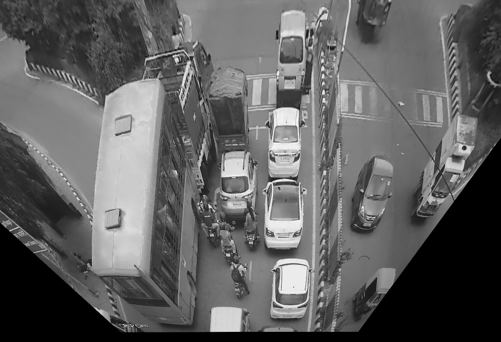
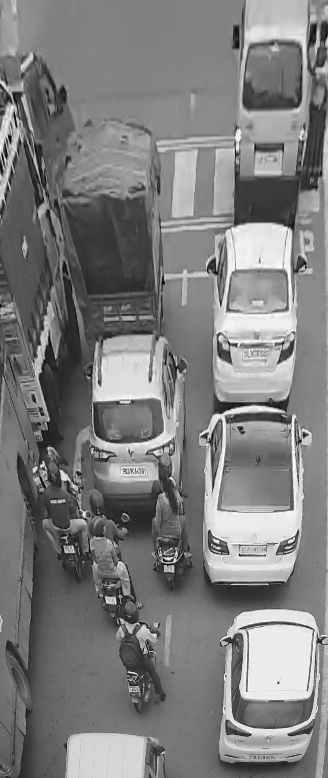

# Traffic Density Estimation

This is a python-based traffic density estimator, works using OpenCV algorithms and functions. Analyses CCTV footage in real time to estimate the density of traffic. Capable of differentiating between idle and moving traffic. Can be used for automatic switching of traffic lights based on traffic density and can even be upgraded to parametrize pedestrian density for higher safety.

It has been implemented in three stages. Each stage either adds up features or increases the efficiency of the system. The stages are as follows:

## Stage 1: The basic functions
### Perspective correction and frame cropping

This stage implements the most basic and necessary functions. Typically the camera gets an arbitrary view of the road/intersection to be monitored and also contains many unnecessary additional objects in the frame. This stage corrects the camera angle and crops out the unwanted objects from the frame.

The camera angle correction is based on Homography. A Homography is a transformation ( a 3×3 matrix ) that maps the points in one image to the corresponding points in the other image. It can be used for perspective correction, panoramic stitching and virtual advertisments. For more info on homography, please check [this](https://docs.opencv.org/master/d9/dab/tutorial_homography.html) and [this](https://learnopencv.com/homography-examples-using-opencv-python-c/).

   
	Unprocessed initial frame

   
	Perspective corrected

   
	Final post processing frame

